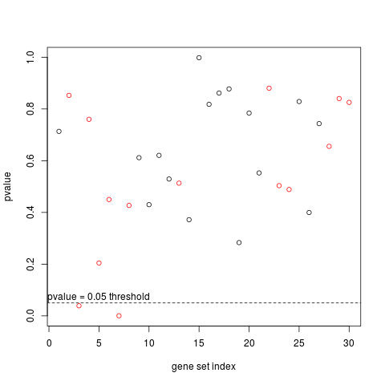
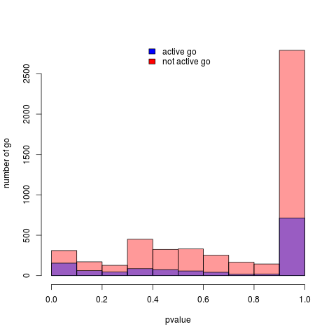

# simugo

This repository contains the R script and explaination to simulate go enrichment studies, and test for go enrichment.


## Background

In modern studies, the size of dataset shifted the focus from the study of single genes to many many genes in a single experiment. In order to  derive  biological conclusions from these large dataset, we focus on designed set of genes, such as Gene Ontology (GO).

Although gene set enrichment are widely used, and several methods exists to study them, there are still many challenges associated with them. We address these challenges by proposing a simulation framework to study current and new methods of gene set enrichment available in the package *simugo*.


## Simulation framework:

In this framework we simulate:

* **n** genes which are either ACTIVE or NOT ACTIVE
* **k** set of genes which are either ACTIVE or NOT ACTIVE
* a network **M** that represents which genes belong to which set

#### 1. Creating the M genes to set network:

Two options

- Either download a real network from Ensembl
 
 *This is the best option to create a realistic topology with hierarchical structure. One must be careful with the size of the data*
 

- Or simulate a network

*This is a simpler option to test the behavior of the enrichment tests wrt bias*

The method  `makeset` creates a random network, as a function of the number of genes, gene sets and the mean number of gene set that a gene is associated to.

#### 2. Simulating a bias 

* a bias per gene independant on the gene set

For example longer genes are more often detected as active

* a bias per gene dependant on the gene set

For example longer genes are more often detected as active, and gene set have different average gene length


#### 3. Simulate the activity (e.g. the experiment)

* a certain portion of gene set are assigned as active
* for each gene set:

   each gene is assigned as active, with a probability that is linearly correlated with the bias

   prob(gene=1|go=1)=a\*bias+b with a and b such that  0<a \* bias+b< 1 

The method `simuExp` computes the random biases and simulate the activity.

#### 4. Infer the activity of the gene sets

Finally you can run the typical gene set enrichment test such as the hypergeometric tests. For each gene set, the method `dotest` compute a pvalue corrected for multiple testing (FDR method by default).


#### Small example


```

### example of the use of the package

## 1st example

## create a network
set.seed(33)
mockgeneset=makeset(nbgo=30,nbgenes=100,nbgopergenes=5)


## create an experiment where longer genes are more active

distribution="normal" # parameters needed to simulate the bias in the measure of the activity
sdBias=10
meanBias=10
advantage=0.5
goforce=0.9
nbgoselected=0.5

experiment <- simuExp(mockgeneset,meanBias,sdBias, distribution,popGoExp,advantage,goforce,nbgoselected)
experiment # this object contains the data for a simulated experieents, with a list of active go and a list of active genes and their simulated covariate


## test for enrichment 
result=dotest(experiment) # for each gene set return the adjusted pvalue corresponding to different methods and the mean value of the bias of its genes


plot(result$pval_classic,col=result$active+1) # shows the pvalue color coded by the true activity of the gene set - the pvalue are corrected for mutiple testing with FDR
abline(0.05,0,lty=2) # pvalue threshold at 0.05
# in this example, only the truly active go are significantly active, but many active go are not picked by the method as significantly active


## 2nd example
set.seed(32)
mockgeneset=makeset(nbgo=30,nbgenes=1000,nbgopergenes=5)

## create an experiment where longer genes are more active

distribution="normal" # parameters needed to simulate the bias in the measure of the activity
sdBias=10
meanBias=10
advantage=0.5
goforce=0.9
nbgoselected=0.5

experiment <- simuExp(mockgeneset,meanBias,sdBias, distribution,popGoExp,advantage,goforce,nbgoselected)
experiment # this object contains the data for a simulated experieents, with a list of active go and a list of active genes and their simulated covariate


## test for enrichment 
result=dotest(experiment) # for each gene set return the adjusted pvalue corresponding to different methods and the mean value of the bias of its genes


plot(result$pval_classic,col=result$active+1) # shows the pvalue color coded by the true activity of the gene set
abline(0.05,0,lty=2) # pvalue threshold at 0.05
# in this second, we find similar result as the first one but because we increase the number of genes per gene set, we obtain more true positive
```


```
## 2nd example
set.seed(32)
mockgeneset=makeset(nbgo=30,nbgenes=1000,nbgopergenes=5)

## create an experiment where longer genes are more active

distribution="normal" # parameters needed to simulate the bias in the measure of the activity
sdBias=10
meanBias=10
advantage=0.5
goforce=0.9
nbgoselected=0.2
experiment <- simuExp(mockgeneset,meanBias,sdBias, distribution,popGoExp,advantage,goforce,nbgoselected)
experiment # this object contains the data for a simulated experieents, with a list of active go and a list of active genes and their simulated covariate

## test for enrichment 
result=dotest(experiment) # for each gene set return the adjusted pvalue corresponding to different methods and the mean value of the bias of its genes
plot(result$pval_classic,col=result$active+1) # shows the pvalue color coded by the true activity of the gene set
abline(0.05,0,lty=2) # pvalue threshold at 0.05
# in this second, we find similar result as the first one but because we increase the number of genes per gene set, we obtain more true positive
```


These two first example were using simulated networks that will not reflect the specific topology of gene set. We present a third example that loads the exisiting saccharomyces cerevisiae GO network

```
## 3rd example

set.seed(32)
mockgeneset=yeastnetwork()
## in this example we use the real yeast go 

distribution="normal" # parameters needed to simulate the bias in the measure of the activity
sdBias=10
meanBias=10
advantage=0.5
goforce=0.9
nbgoselected=0.2
experiment <- simuExp(mockgeneset,meanBias,sdBias, distribution,popGoExp,advantage,goforce,nbgoselected)
experiment # this object contains the data for a simulated experieents, with a list of active go and a list of active genes and their simulated covariate

## test for enrichment 
result=dotest(experiment) # for each gene set return the adjusted pvalue corresponding to different methods and the mean value of the bias of its genes
plot(result$pval_classic,col=result$active+1) # shows the pvalue color coded by the true activity of the gene set
abline(0.05,0,lty=2) # pvalue threshold at 0.05

hist(result$pval_classic[which(!result$active)],col=rgb(1,0,0,0.4),xlab="pvalue",ylab="number of go")
hist(result$pval_classic[which(result$active==1)],col=rgb(0,0,1,0.4),add=T)
legend('topright',c("active","not active"),col=c("blue","red"),lty=1)

```



----------------------------------

Created by Elsa Guilllot, University of the West of England
